 

## 工作流合集
Yolain's ComfyUI Workflows Collection

[基础工作流](#基础工作流)  |  [进阶工作流](#进阶工作流)  |  [实用工作流](#实用工作流)
 

### 目录

- 0.[用前必读](#用前必读)
- 1.[基础工作流](#基础工作流)
  - 1-1.[文生图](#1-1-文生图)
  - 1-2.[图生图](#1-2-图生图)
  - 1-3.[节点束输入、输出、编辑](#1-3-节点束输入-输出-编辑)
  - 1-4.[通配符与风格提示词](#1-4-通配符与风格提示词)
  - 1-5.[ControlNet](#1-5-controlnet)
  - 1-6.[细节修复](#1-6-细节修复)
  - 1-7.[XY对比](#1-7-xy对比)
  - 1-8.[单项对比](#1-8-单项对比)
  - 1-9.[图像反推提示词](#1-9-图像反推提示词)
  - 1-10.[背景去除](#1-10-背景去除)
  - 1-11.[重绘/扩图](#1-11-重绘扩图)
  - 1-12.[噪声注入/风格对齐](#1-12-噪声注入)
  - 1-13.[Stable Cascade](#1-13-stable-cascade)
  - 1-14.[Stable Diffusion 3 API（可配置多个apikey）](#1-14-stable-diffusion-3-api)
  - 1-15.[CosXL图像编辑](#1-15-CoxXL图像编辑)
- 2.进阶工作流
  - 2-1.[ipadapter（风格迁移）](#2-1-ipadapter)
  - 2-2.[instantID（人脸迁移）](#2-2-instantid)
  - 2-3.[LayerDiffusion (透明图像生成)](#2-3-layerdiffusion)
  - 2-4.[局部重绘进阶 (Brushnet等)](#2-4-局部重绘进阶)
  - 2.5.[IC-Light (重绘光影)](#2-5-ic-light)
- 3.实用工作流 
  - 3-1 角色一致性
    - 💎 [3-1-1.角色三视图与特写](#3-1-1-角色三视图与特写)
  - 3-2 电商系列
    - 💎 [3-2-1.电商产品主图](#3-2-1-电商产品主图)

  
### 用前必读
[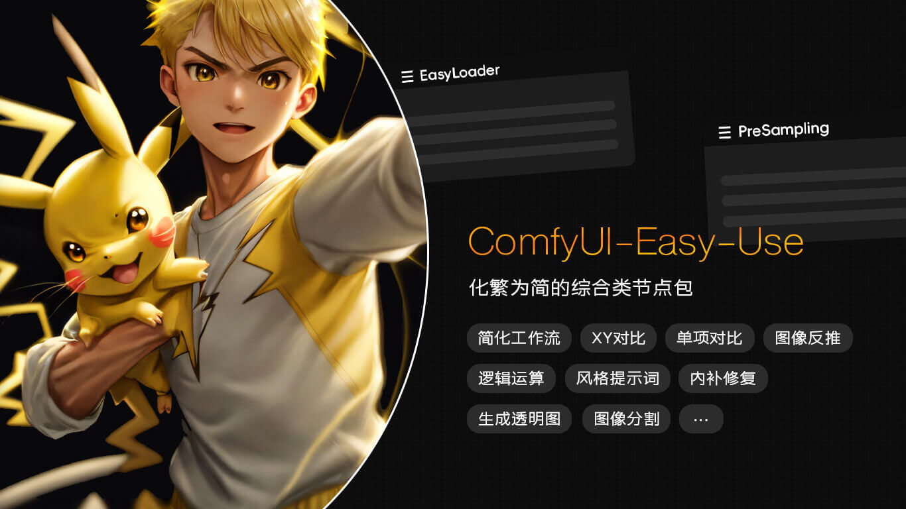](https://github.com/yolain/ComfyUI-Easy-Use)

1. 本合集中的工作流基于 [ComfyUI-Easy-Use](https://github.com/yolain/ComfyUI-Easy-Use) 节点包进行搭建，使用前请确保已安装EasyUse。 
2. 初次使用，请观看 🔽 ComfyUI-Easy-Use 使用技巧。

https://github.com/yolain/ComfyUI-Yolain-Workflows/assets/73304135/f1f4839c-9977-4645-87bd-8146f2f3e3e6

3. 工作流所需节点包列表

| 类型    | 节点包名称                           | 相关链接                                                 | 其他说明                     |
|:------|:--------------------------------|:-----------------------------------------------------|:-------------------------|
| 🔴 必要 | ComfyUI-Easy-Use                | [去下载](https://github.com/yolain/ComfyUI-Easy-Use) | 化繁为简节点包                  |
| 🔵 常规 | AIGODLIKE-COMFYUI-TRANSLATION   | [去下载](https://github.com/AIGODLIKE/AIGODLIKE-ComfyUI-Translation) | 多语言包                     |
| 🔵 常规 | ComfyUI-Manager                 | [去下载](https://github.com/ltdrdata/ComfyUI-Manager) | ComfyUI管理器               |
| 🔵 常规 | ComfyUI-Custom-Scripts          | [去下载](https://github.com/pythongosssss/ComfyUI-Custom-Scripts) | 必备节点包 🐍                 |
| 🔵 常规 | ComfyUI-Impact-Pack             | [去下载](https://github.com/ltdrdata/ComfyUI-Impact-Pack) | 必备增强工具1                  |
| 🔵 常规 | ComfyUI-Inspire-Pack            | [去下载](https://github.com/ltdrdata/ComfyUI-Inspire-Pack) | 必备增强工具2                  |
| 🔵 常规 | was-node-suite-comfyui          | [去下载](https://github.com/WASasquatch/was-node-suite-comfyui) | 必备增强工具3                  |
| 🟢 可选 | ComfyUI_smZNodes                | [去下载](https://github.com/shiimizu/ComfyUI_smZNodes) | 当加载器开启**a1111提示词风格**时必要  |
| 🟢 可选 | ComfyUI-Advanced-ControlNet     | [去下载](https://github.com/Kosinkadink/ComfyUI-Advanced-ControlNet) | CN增强工具，缩放柔和权重<1时必要       |
| 🟢 可选 | ComfyUI_IPAdapter_plus          | [去下载](https://github.com/cubiq/ComfyUI_IPAdapter_plus) | 风格迁移，使用easy的ipa节点时必要     |
| 🟢 可选 | ComfyUI_InstantID               | [去下载](https://github.com/cubiq/ComfyUI_InstantID) | 人脸迁移，使用easy的instant节点时必要 |
| 🟢 可选 | ComfyUI_LayerStyle              | [去下载](https://github.com/chflame163/ComfyUI_LayerStyle) | 图像处理神器                   |
| 🟢 可选 | ComfyUI-BrushNet                | [去下载](https://github.com/nullquant/ComfyUI-BrushNet) | 内补工具，内补采样器选择brushnet时必要  |

4.目前暂时还没有AnimateDiff或视频向工作流,可自行延展。

### 基础工作流

#### 1-1 文生图
[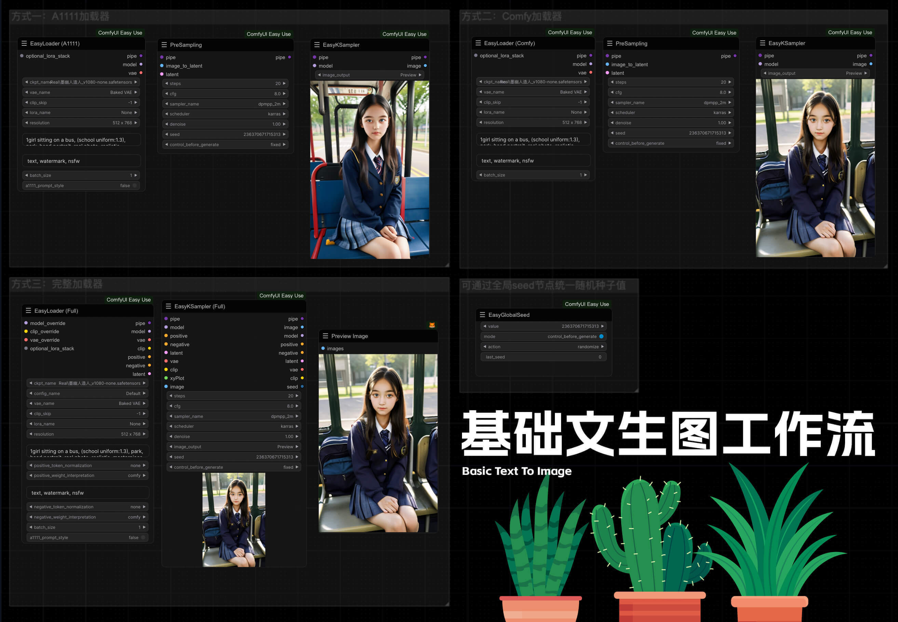](workflows/1_basic/1-1基础文生图.json)
[⬇️ 下载工作流](workflows/1_basic/1-1基础文生图.json) &nbsp;&nbsp;&nbsp;&nbsp;&nbsp; [⤴️ 返回目录](#目录)
#### 1-2 图生图
[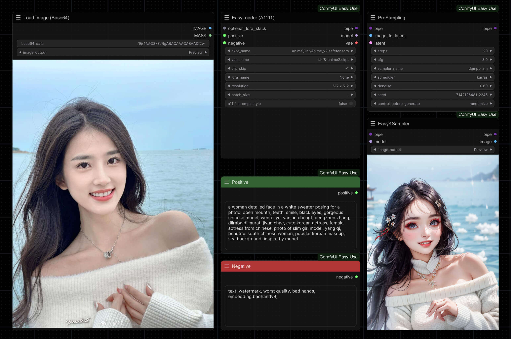](workflows/1_basic/1-2基础图生图.json)
[⬇️ 下载工作流](workflows/1_basic/1-2基础图生图.json) &nbsp;&nbsp;&nbsp;&nbsp;&nbsp; [⤴️ 返回目录](#目录)
#### 1-3 节点束输入 输出 编辑
[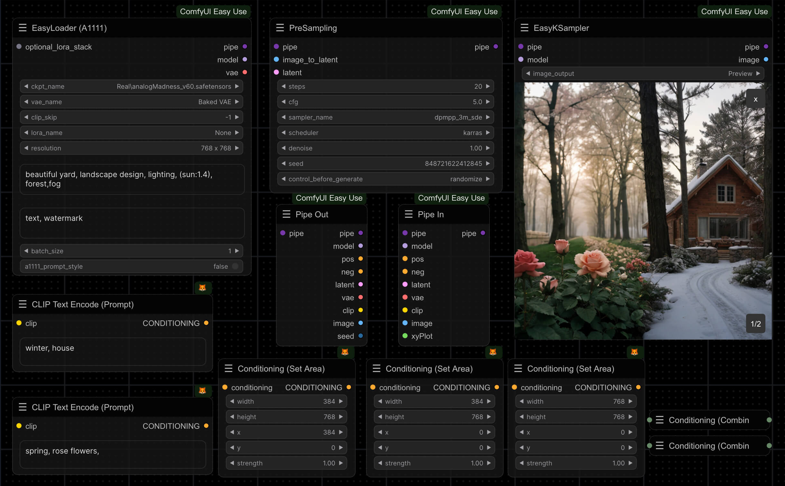](workflows/1_basic/1-3节点束输入输出编辑.json)
[⬇️ 下载工作流](workflows/1_basic/1-3节点束输入输出编辑.json) &nbsp;&nbsp;&nbsp;&nbsp;&nbsp; [⤴️ 返回目录](#目录)
#### 1-4 通配符与风格提示词
[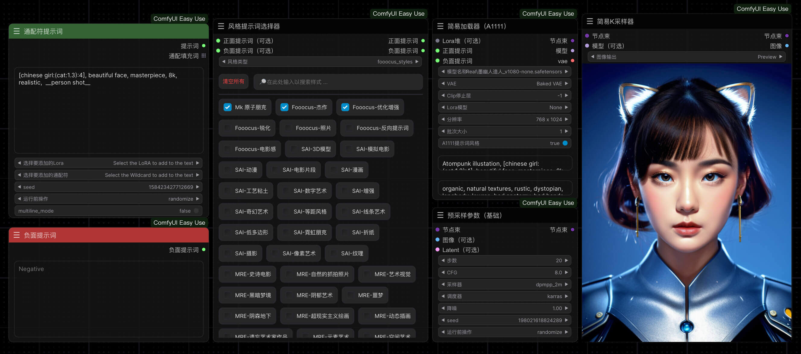](workflows/1_basic//1-4通配符与风格提示词.json)
[⬇️ 下载工作流](workflows/1_basic/1-4通配符与风格提示词.json) &nbsp;&nbsp;&nbsp;&nbsp;&nbsp; [⤴️ 返回目录](#目录)
#### 1-5 ControlNet
[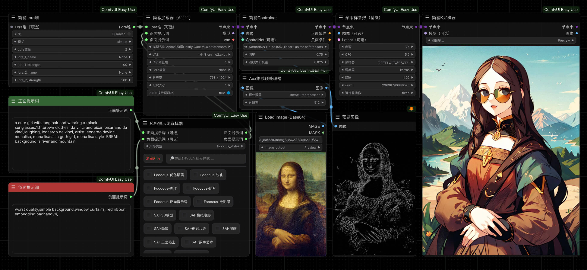](workflows/1_basic/1-5ControlNet.json)
[⬇️ 下载工作流](workflows/1_basic/1-5ControlNet.json) &nbsp;&nbsp;&nbsp;&nbsp;&nbsp; [⤴️ 返回目录](#目录)
#### 1-6 细节修复
[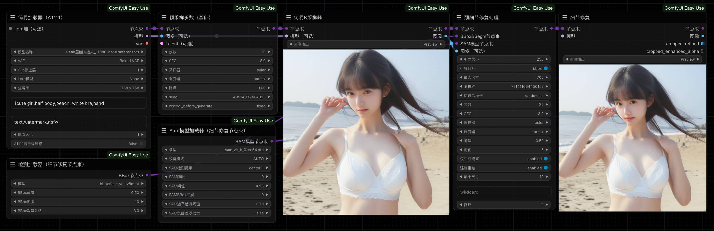](workflows/1_basic/1-6细节修复.json)
[⬇️ 下载工作流](workflows/1_basic/1-6细节修复.json) &nbsp;&nbsp;&nbsp;&nbsp;&nbsp; [⤴️ 返回目录](#目录)
#### 1-7 XY对比
[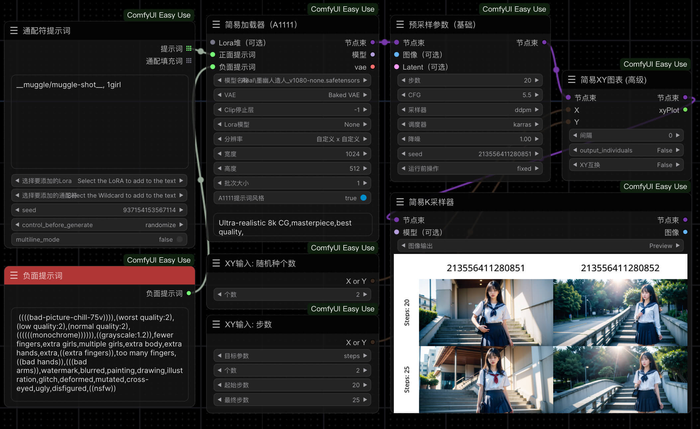](workflows/1_basic/1-7XY对比.json)
[⬇️ 下载工作流](workflows/1_basic/1-7XY对比.json) &nbsp;&nbsp;&nbsp;&nbsp;&nbsp; [⤴️ 返回目录](#目录)
#### 1-8 单项对比
[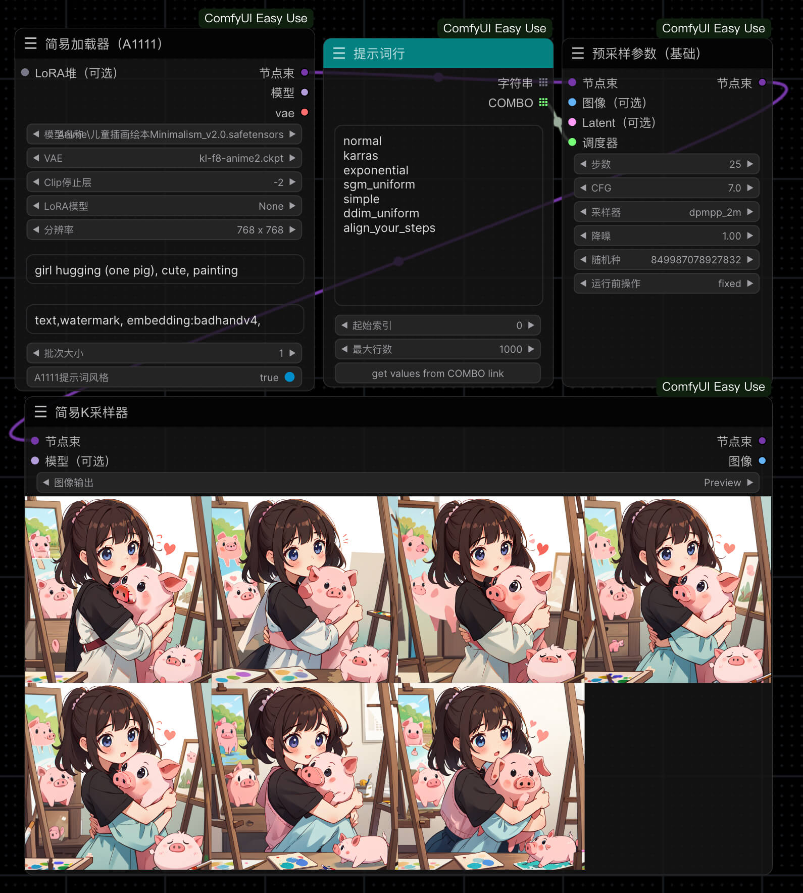](workflows/1_basic/1-8单项对比.json)
[⬇️ 下载工作流](workflows/1_basic/1-8单项对比.json) &nbsp;&nbsp;&nbsp;&nbsp;&nbsp; [⤴️ 返回目录](#目录)
#### 1-9 图像反推提示词
[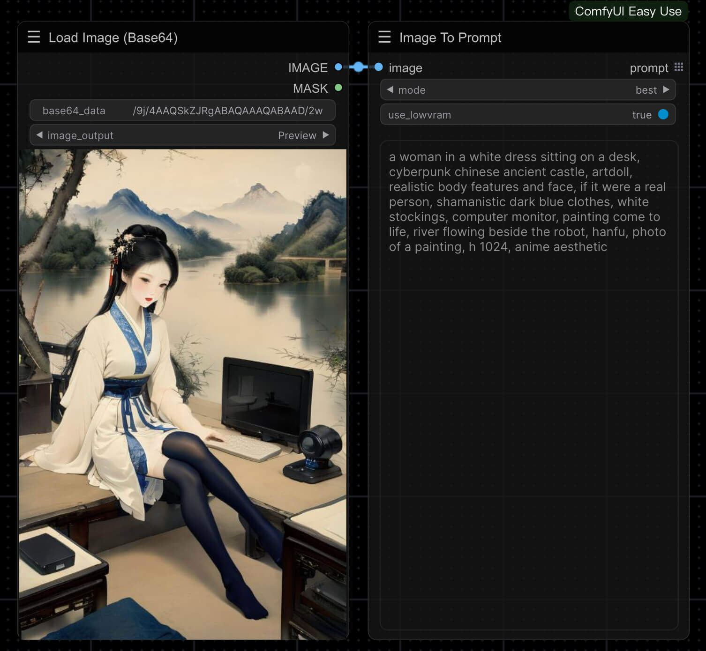](workflows/1_basic/1-9图像反推提示词.json)
[⬇️ 下载工作流](workflows/1_basic/1-9图像反推提示词.json) &nbsp;&nbsp;&nbsp;&nbsp;&nbsp; [⤴️ 返回目录](#目录)
#### 1-10 背景去除

[⬇️ 下载工作流](workflows/1_basic/1-10背景去除.json) &nbsp;&nbsp;&nbsp;&nbsp;&nbsp; [⤴️ 返回目录](#目录)
#### 1-11 重绘扩图
[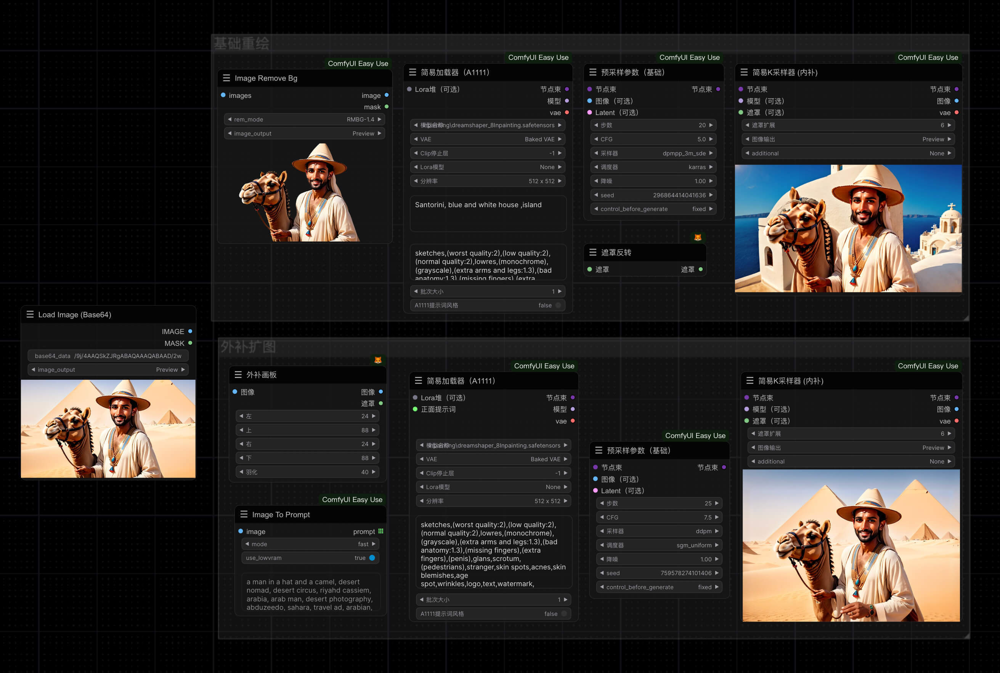](workflows/1_basic/1-11重绘扩图.json)
[⬇️ 下载工作流](workflows/1_basic/1-11重绘_扩图.json) &nbsp;&nbsp;&nbsp;&nbsp;&nbsp; [⤴️ 返回目录](#目录)
#### 1-12 噪声注入
[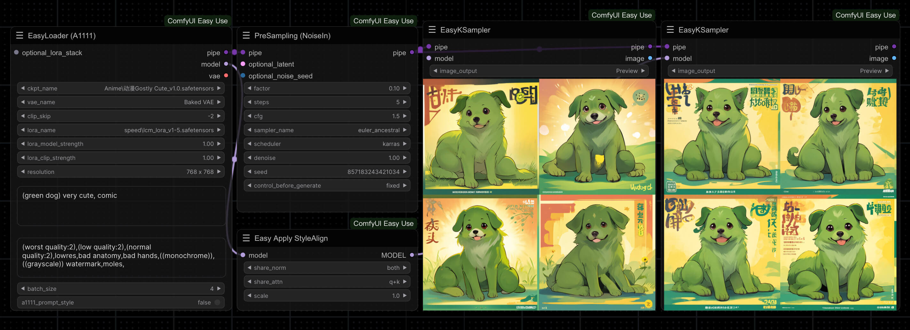](workflows/1_basic/1-12噪声注入.json)
[⬇️ 下载工作流](workflows/1_basic/1-12噪声注入.json) &nbsp;&nbsp;&nbsp;&nbsp;&nbsp; [⤴️ 返回目录](#目录)
#### 1-13 Stable Cascade
[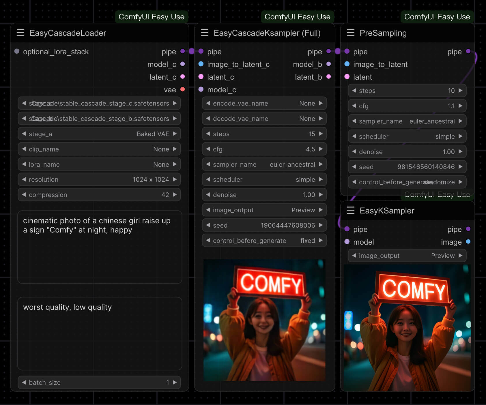](workflows/1_basic/1-13StableCascade.json)
[⬇️ 下载工作流](workflows/1_basic/1-13StableCascade.json) &nbsp;&nbsp;&nbsp;&nbsp;&nbsp; [⤴️ 返回目录](#目录)
#### 1-14 Stable Diffusion 3 API

[⬇️ 下载工作流](workflows/1_basic/1-14SD3API.json) &nbsp;&nbsp;&nbsp;&nbsp;&nbsp; [⤴️ 返回目录](#目录)
#### 1-15 CosXL图像编辑

[⬇️ 下载工作流](workflows/1_basic/1-15CosXL图像编辑.json) &nbsp;&nbsp;&nbsp;&nbsp;&nbsp; [⤴️ 返回目录](#目录)

### 进阶工作流
#### 2-1 ipadapter
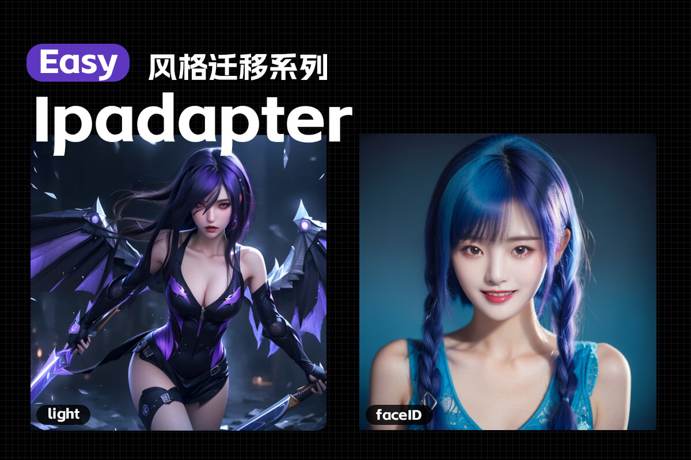
[⤴️ 返回目录](#目录)

| 工作流名称      | 文件                                                                          | 说明                |
|:-----------|:----------------------------------------------------------------------------|:------------------|
| 基础         | [⬇️ 下载](workflows/2_advanced/2-1ipadater/ipadater_basic.json) | 组成ipadater的最基本的流程 |
| 区域混合       | 待更新                                                                         | 精准控制每个区域，区域内容混合应用
| 权重预置       | 待更新                                                                         | 预设权重，可实现不同转场效果
#### 2-2 instantID

[⤴️ 返回目录](#目录)

| 工作流名称 | 文件                                                                  | 说明                 |
|:------|:--------------------------------------------------------------------|:-------------------|
| 基础    | [⬇️ 下载](workflows/2_advanced/2-2instantID/2-2instantID_simple.json) | 组成instantID的最基本的流程 |
| 百变表情包 | [⬇️ v1.0下载](workflows/2_advanced/2-2instantID/百变大头贴v1.json)         | 单个采样器生成多张图，实现表情包自由 |

#### 2-3 LayerDiffusion

[⤴️ 返回目录](#目录)

| 工作流名称    | 文件                                                                    | 说明                 |
|:---------|:----------------------------------------------------------------------|:-------------------|
| 透明图像生成   | [⬇️ 下载](workflows/2_advanced/2-3layerDiffuse/2-3layerDiffuse透明图.json) | LayerDiffuse最核心的功能 |
| 前景生成背景   | 待更新                                                                   | -                  |
| 背景生成前景   | 待更新                                                                   | -                  |
| 从背景中移除前景 | 待更新                                                                   | -                  |

#### 2-4 局部重绘进阶

[⤴️ 返回目录](#目录)

| 工作流名称            | 文件                                                                                                                                                              | 说明                                       |
|:-----------------|:----------------------------------------------------------------------------------------------------------------------------------------------------------------|:-----------------------------------------|
| 局部重绘简易对比         | [⬇️ 下载](workflows/2_advanced/2-4inpainting/2-4InpaintingAll.json)                                                                                               | 需要安装ComfyUI-BrushNet并下载对应模型              |
| FooocusInpaint使用 | [⬇️ 下载](workflows/2_advanced/2-4inpainting/2-4fooocus_inpaint.json)                                                                                             | 需要下载FooocusInpaint模型                     |
| BrushNet使用       | [⬇️ 便捷节点](workflows/2_advanced/2-4inpainting/2-4brushnet_1.1.8.json)   [⬇️ 原版节点](workflows/2_advanced/2-4inpainting/2-4brushnet.json)                        | 便捷节点需 EasyUse v1.1.8及以上版本，模型下载地址请查看工作流向导              |
| PowerPaint使用     | [⬇️ 便捷节点](workflows/2_advanced/2-4inpainting/2-4powerpaint_outpaint_1.1.8.json) [⬇️ 原版节点](workflows/2_advanced/2-4inpainting/2-4powerpaint_outpainting.json) | 便捷节点需 EasyUse v1.1.8及以上版本，模型下载地址请查看工作流向导 |

#### 2-5 IC-Light

[⤴️ 返回目录](#目录)

| 工作流名称   | 文件                                                             | 说明                 |
|:--------|:---------------------------------------------------------------|:-------------------|
| 输入前景    | [⬇️ 下载](workflows/2_advanced/2-5ICLight/2-5ICLight输入前景.json)   | -                  |
| 输入前景&背景 | [⬇️ 下载](workflows/2_advanced/2-5ICLight/2-5ICLight输入前景背景.json) | -                  |

### 实用工作流

#### 3-1 角色一致性
##### 3-1-1 角色三视图与特写
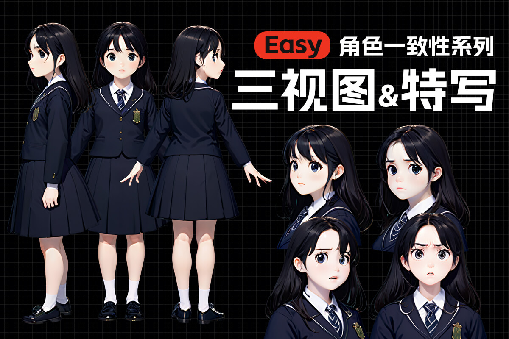
[⤴️ 返回目录](#目录)

| 工作流名称 | 文件                                                | 说明 |
|:------|:--------------------------------------------------|:---|
| 基础流程  | [⬇️ 下载](workflows/3_awesome/3-1/3-1-1_basic.json) | -  |

#### 3-2 电商系列
##### 3-2-1 电商产品主图

[⬇️ 下载工作流](workflows/3_awesome/3-2/3-2-1电商产品主图.json) &nbsp;&nbsp;&nbsp;&nbsp;&nbsp;[⤴️ 返回目录](#目录)
